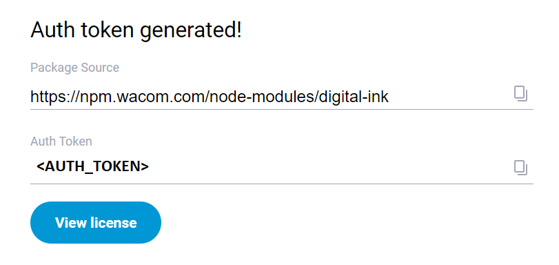
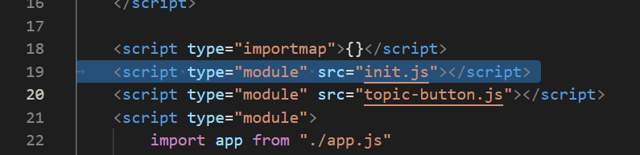
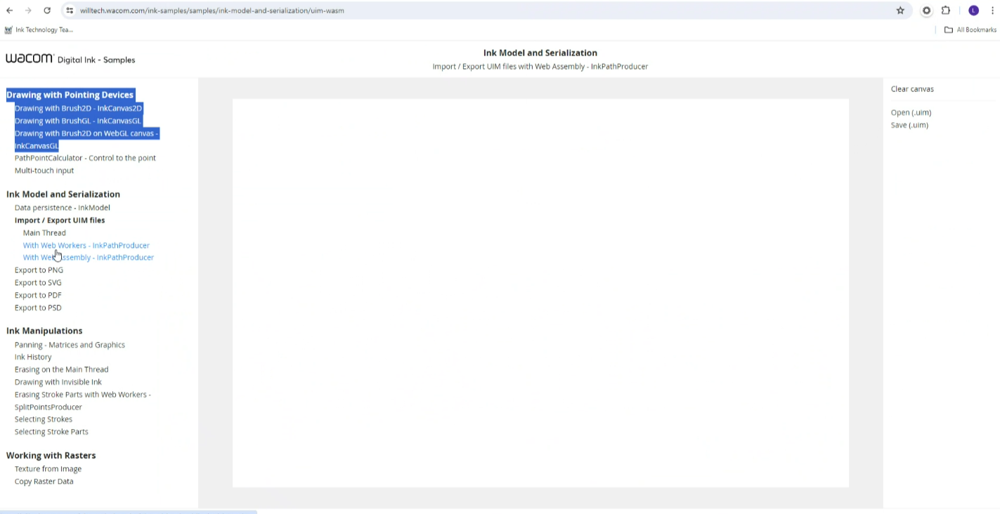

# Getting Started

## Download the SDK

Download the SDK from https://developer.wacom.com/developer-dashboard

- Login using your Wacom ID
- On the Developer Dashboard, go to **Will3 SDK for ink for Web**
- Select **More info**
- Accept the End User License Agreement to use the SDK
- Copy the Auth Token at the bottom of the page.



This should be added and saved to an `.npmrc` file. 

```.npmrc
always-auth
registry=https://npm.wacom.com/node-modules/
//npm.wacom.com/node-modules/:_authToken=<AUTH_TOKEN_HERE>
```

Replace `<AUTH_TOKEN_HERE>` with your Auth Token. 

For more information on the `.npmrc` file, please view the [Using the WILL Ink Sample Code](#using-the-will-sdk-sample-code) section of this document.

## SDK License

An evaluation license may be generated beneath the Auth Token. It can subsequently be retrieved from https://developer.wacom.com/en-us/developer-dashboard/license-keys. Alternatively, please contact support and request an evaluation license at https://developer-support.wacom.com/hc/en-us/requests/new.

This new version allows testing of the SDK and sample without a license when running in your local environment. Once users are ready to deploy their application, however, a license is necessary. 

### Using the license

#### Client Side

For users using a license:

- Within `samples/src/client`, create a new file with the name `digital-ink-license.mjs`. It is required to have the following contents:

```javascript
export default "<LICENSE_TOKEN>";
```

- Replace `<LICENSE_TOKEN>` with your license token. 

For users testing their application locally:

- Comment out the script tag for `init.js`:



#### Server Side

For the server, a domain name is required to issue the license:

```javascript
// Uncomment if you have a license. Without a license, it will work only on localhost
//import license from "./digital-ink-license.mjs"
```

It is required to create a new file, `digital-ink-license.mjs`. This should be placed in `samples/src/server`. 

It will have this content:

```javascript
export default {
  identity: "Identity",
  jwt: "<LICENSE_TOKEN>",
};
```

Insert your license token into the `jwt` value.

## Using the WILL SDK Sample Code

In order to build the sample, the following are required:

1. `npm`
2. Access to the Internet

Inside the sample, insert the previously saved `.npmrc` file containing the authorization for downloading the SDK into `samples/src`.

### Steps to Build the Sample:

- Extract the contents of the SDK ZIP into your directory.
- Where you've extracted the contents to, run `npm install`. This will download all dependencies within a `node_modules` folder and the Wacom SDK.
- Run `npm start` to run the sample on:

1. a local machine, or
2. via IP. If in the browser, `[MachineIp]:8080` is opened, the WebAssembly and new WILL version can be tested.

**NB:** The sample is structured to learn our SDK starting from the 1st sample to the last.



---
